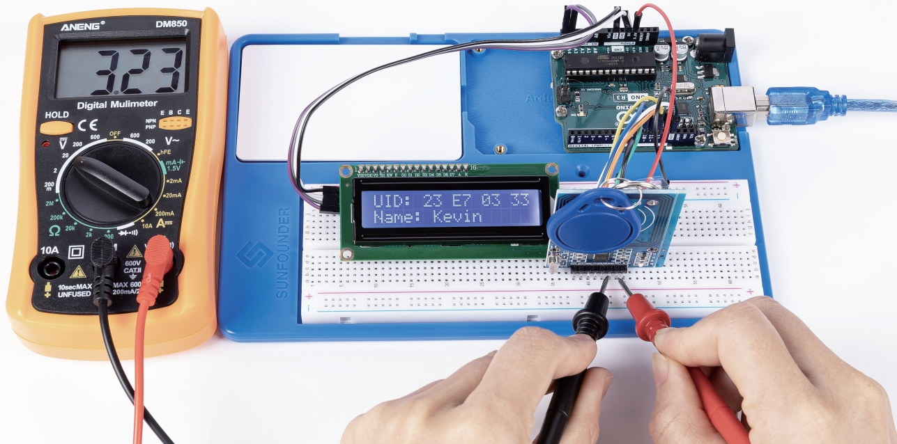

.. note::

    Hello, welcome to the SunFounder Raspberry Pi & Arduino & ESP32 Enthusiasts Community on Facebook! Dive deeper into Raspberry Pi, Arduino, and ESP32 with fellow enthusiasts.

    **Why Join?**

    - **Expert Support**: Solve post-sale issues and technical challenges with help from our community and team.
    - **Learn & Share**: Exchange tips and tutorials to enhance your skills.
    - **Exclusive Previews**: Get early access to new product announcements and sneak peeks.
    - **Special Discounts**: Enjoy exclusive discounts on our newest products.
    - **Festive Promotions and Giveaways**: Take part in giveaways and holiday promotions.

    👉 Ready to explore and create with us? Click [|link_sf_facebook|] and join today!

Inventor Lab Kit with Original Arduino Uno R3
=================================================

Thank You for Choosing the Inventor Lab Kit.

.. .. note::
..     This document is available in the following languages.

..         * |link_german_tutorials|
..         * |link_jp_tutorials|
..         * |link_en_tutorials|
    
..     Please click on the respective links to access the document in your preferred language.

* :download:`Inventor Lab Kit Handbook with the Answers </_static/pdf/Inventor Lab Kit Handbook with the Answers.pdf>`

Embark on your electronics journey with the Inventor Lab Kit, designed for learners and enthusiasts. Centered around the Arduino Uno R3, this kit includes everything from basic components like LEDs and buzzers to advanced modules such as RFID systems and ultrasonic sensors, along with a mini-multimeter for circuit analysis.

The kit excels in educational clarity, gradually introducing beginners to programming and circuit design. Instead of pre-written code, it guides you step-by-step through writing your own scripts, enhancing understanding and retention. Projects range from simple tasks like lighting LEDs and using a joystick, to complex applications such as building a radar system and an automatic soap dispenser.

Ideal for both beginners and those looking to expand their skills, the Inventor Lab Kit makes learning both accessible and exciting, providing all the tools needed to explore and innovate in the world of electronics.

.. toctree::
    :maxdepth: 1

    About this Kit <self>
    1_get_started
    2_first_circuit
    3_multimeter
    4_ohm's_law
    5_parallel_series_circuit
    6_blink_led
    7_traffic_light_auto 
    8_traffic_light_button 
    9_desk_lamp 
    10_morse_code
    11_rainbow_color
    12_siren
    13_joystick_led_navigator
    14_play_dinosaur_game
    15_cool_warm_color
    16_summer_fan
    17_i2c_lcd1602
    18_on_off_desk_lamp
    19_smart trashcan
    20_automatic_soap_dispenser
    21_thermistor
    22_ir_receiver
    23_little_star
    24_beep_timer
    25_reversing_alarm
    26_cyber_dice
    27_flowing_light
    28_show_number
    29_plant_monitor
    30_radar 
    31_guess_number 
    32_stopwatch 
    33_rfid_module 
    34_access_control_system

**Copyright Notice**

All contents including but not limited to texts, images, and code in this manual are owned by the SunFounder Company. You should only use it for personal study,investigation, enjoyment, or other non-commercial or nonprofit purposes, under therelated regulations and copyrights laws, without infringing the legal rights of the author and relevant right holders. For any individual or organization that uses these for commercial profit without permission, the Company reserves the right to take legal action.

