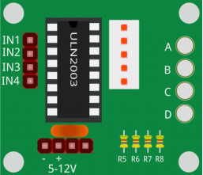

17. Exploring the Stepper Motor
================================================

.. .. raw:: html

..     <video width="600" loop autoplay muted>
..         <source src="_static/video/16_summer_fan.mp4" type="video/mp4">
..         Your browser does not support the video tag.
..     </video>
  
In this lesson, you will learn about controlling Stepper Motors, specifically the 28BYJ-48 model, using a ULN2003 driver and an Arduino Uno R4. Stepper motors are used in a variety of applications such as 3D printers, CNC machines, robotics, and even in common household appliances. Their precise control allows for intricate movements, making them ideal for projects that require high positional accuracy.

In this project, we will be configuring the 28BYJ-48 stepper motor to rotate in both clockwise and counter-clockwise directions at different speeds. Stepper motors like these are often used in automated systems to rotate objects or drive mechanisms that require precise control. For example, they can be used in automatic curtains, where the curtains open or close at specific times or under specific conditions. By understanding how to control a stepper motor’s rotation and speed, you’ll be well on your way to incorporating them into your own electronic projects.

Build the Circuit
------------------------------------

**Components Needed**

.. list-table:: 
   :widths: 25 25 25 25
   :header-rows: 0

   * - 1 * Arduino Uno R3
     - 1 * I2C LCD1602
     - 1 * Breadboard
     - 1 * USB Cable
   * - |components_uno_r3|
     - |components_i2c_lcd1602| 
     - |components_breadboard|
     - |components_usb_cable|
   * - Jumper Wires
     - 
     - 
     - 
   * - |components_wire|
     - 
     - 
     - 

**Building Steps**

Follow the wiring diagram, or the steps below to build your circuit.

.. image:: img/17_lcd_connect.png
    :width: 700
    :align: center

.. image:: img/stepper_motor2.jpeg
   :align: center

Stepper motors, due to their unique design, can be controlled to a high degree of accuracy without any feedback mechanisms. The shaft of a stepper, mounted with a series of magnets, is controlled by a series of electromagnetic coils that are charged positively and negatively in a specific sequence, precisely moving it forward or backward in small
"steps".

**Principle**

There are two types of steppers, unipolars and bipolars, and it is very important to know which type you are working with. In this experiment, we will use a unipolar stepper.

The stepper motor is a four-phase one, which uses a unipolarity DC power supply. As long as you electrify all phase windings of the motor by an appropriate timing sequence, you can make it rotate step by step. The schematic diagram of a four-phase reactive stepper motor:

.. image:: img/stepper_motor3.png
   :align: center

In the figure, in the middle of the motor is a rotor - a gear-shaped permanent magnet. Around the rotor, 0 to 5 are teeth. Then more outside, there are 8 magnetic poles, with each two opposite ones connected by coil winding. So they form four pairs from A to D, which is called a phase. It has four lead wires to be connected with switches SA, SB, SC, and SD. Therefore, the four phases are in parallel in the circuit, and the two magnetic poles in one phase are in series.

**Here's how a 4-phase stepper motor works:**

At the beginning, switch SB is power on, switch SA, SC, and SD is power off, and B-phase magnetic poles align with tooth 0 and 3 of the rotor. At the same time, tooth 1 and 4 generate staggered teeth with C- and D-phase poles. Tooth 2 and 5 generate staggered teeth with D- and A-phase poles. When switch SC is power on, switch SB, SA, and SD is power off, the rotor rotates under magnetic field of C-phase winding and that between tooth 1 and 4. Then tooth 1 and 4 align with the magnetic poles of C-phase winding. While tooth 0 and 3 generate staggered teeth with A- and B-phase poles, and tooth 2 and 5 generate staggered teeth with the magnetic poles of A- and D-phase poles. The similar situation goes on and on. Energize the A, B, C and D phases in turn, and the rotor will rotate in the order of A, B, C and D.

The four-phase stepper motor has three operating modes: single four-step, double four-step, and eight-step. The step angle for the single four-step and double four-step are the same, but the driving torque for the single four-step is smaller. The step angle of the eight-step is half that of the single four-step and double four-step. Thus, the eight-step operating mode can keep high driving torque and improve control accuracy. In this experiment, we let the stepper motor work in the eight-step mode.

**ULN2003 Module**

To apply the motor in the circuit, a driver board needs to be used. Stepper Motor Driver-ULN2003 is a 7-channel inverter circuit. That is, when the input end is at high level, the output end of ULN2003 is at low level, and vice versa. If we supply high level to IN1, and low level to IN2, IN3 and IN4, then the output end OUT1 is at low level, and all the other output ends are at high level. So D1 lights up, switch SA is power on, and the stepper motor rotates one step. The similar case repeats on and on. Therefore, just give the stepper motor a specific timing sequence, it will rotate step by step. The ULN2003 here is used to provide particular timing sequences for the stepper motor.

1. When using motors, servos, and other actuators, it's recommended to use an external power supply to avoid damaging the main board. Insert the breadboard power module into the breadboard, then use a jumper wire to connect the negative rail of the breadboard to the GND of the Arduino Uno R3 to achieve a common ground.

.. image:: img/14_dinosaur_power_module.png
    :width: 400
    :align: center

.. note::

    The order of the positive and negative terminals on the breadboard in the wiring diagram is reversed compared to the breadboard provided in the kit.

    In actual wiring, you need to insert the breadboard power module from the higher number side (60~65) so that the "-" of the power module goes into the negative rail "-" of the breadboard, and the "+" into the positive rail "+".

    .. image:: img/14_dinosaur_plug_power_module.png
        :width: 400
        :align: center

2. 将步进电机插入到ULN2003驱动板上。

3. 将ULN2003的IN1接Arduino Uno R3的2引脚，IN2接4引脚，IN3接3引脚，IN4接5引脚。

4. 最后将ULN2003模块的“-”连接到面包板的负极端，“+”连接到正极端。

Initialize the stepper

#include <Stepper.h>  // Include the Stepper library

#define STEPS 2038                   // Define the number of steps per revolution for the motor
Stepper stepper(STEPS, 2, 3, 4, 5);  // Initialize stepper object and set pin connections (IN1, IN2, IN3, IN4)
Include a head file Stepper.h, set the steps to 2038 and then initialize the stepper with a function stepper().

STEPS: The number of steps in one revolution of your motor. For this stepper motor, this value is 2038.

Stepper(steps, pin1, pin2, pin3, pin4): This function creates a new instance of the Stepper class that represents a particular stepper motor attached to your Arduino board. The pins pin1, pin2, pin3, and pin4 correspond to the IN1, IN2, IN3, and IN4 pins on the ULN2003 driver.

loop() function

void loop() {
  // Rotate clockwise at 5 RPM
  stepper.setSpeed(5);
  stepper.step(STEPS);  // Rotate one full revolution clockwise
  delay(1000);          // Wait for 1 second

  // Rotate counter-clockwise at 15 RPM
  stepper.setSpeed(15);
  stepper.step(-STEPS);  // Rotate one full revolution counter-clockwise
  delay(1000);           // Wait for 1 second
}
The main program rotates the stepper motor continuously, completing one full clockwise circle at 5 RPM and then one full counter-clockwise circle at 15 RPM.

setSpeed(rpms): Sets the motor speed in rotations per minute (RPMs). This function doesn’t make the motor turn, just sets the speed at which it will when you call step().

rpms: the speed at which the motor should turn in rotations per minute - a positive number (long)

step(steps): This function rotates the motor by a specified number of steps, using the speed set in the most recent call to setSpeed(). It is important to note that this function operates in a blocking manner, meaning it will wait until the motor has completed its movement before allowing control to proceed to the next line in your sketch.

For instance, if you were to set the speed at 1 RPM and called step(2038) on a motor with 2038 steps, it would take one full minute for this function to execute. To achieve more precise control, it is recommended to maintain a higher speed and only move a few steps with each call to step().

steps: the number of steps to turn the motor - positive to turn one direction, negative to turn the other (int).